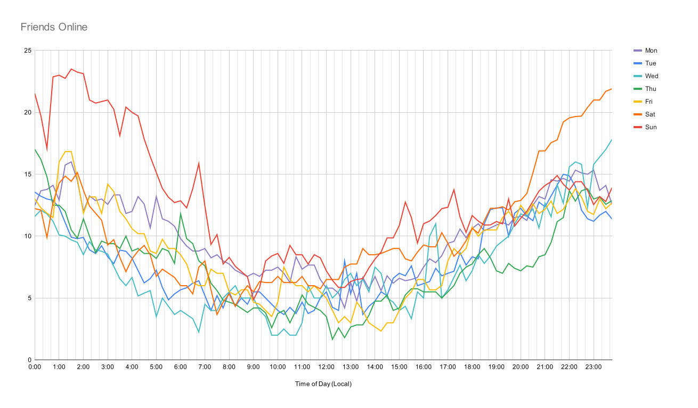

# VRCX Optimal Time

Uses your stored [VRCX](https://github.com/pypy-vrc/VRCX) data to calculate when your friends are online. This data can then be used to chart the optimal times for you to play VRChat if you want to hang out with your friends!

For the best results, you'll need to have used VRCX for a reasonably long time to gather enough data to show trends.

## Installation & Usage

1. Download [vrcx-optimal-time.exe](https://github.com/zkxs/vrcx-optimal-time/releases/latest/download/vrcx-optimal-time-windows-x64.exe), or [your platform's artifact](https://github.com/zkxs/vrcx-optimal-time/releases/latest) for non-Windows OS's.
2. Place the file wherever you want.
3. Create a file name `config.toml` next to the vrcx-optimal-time executable
4. Fill in the config by referencing the provided [example config.toml](doc/config.toml).
5. Run the application to get tab-delimited output in your console. If you want it in a file, something like `vrcx-optimal-time > output.txt` should work in most shells.
6. Paste the output into your charting software of choice
   - [@RubenPX](https://github.com/RubenPX) has created an easy to use web-based viewer [here](https://px-byte.github.io/vrcx-optimal-time-viewer/).
   - Here's an [example Google Sheet](https://docs.google.com/spreadsheets/d/11kGoZD9BTLpWUGHI9X7rCUGkWk6E5rVGCPmMivXf5_U/edit?usp=sharing) that you can copy, then directly paste the program output into. 
7. Create a neat chart!

## Output

Here's an example chart generated from approximately 200 friends worth of data captured over 2 years. VRCX was running for ~900 hours out of that time span.

## Building from Source
1. [Install Rust](https://www.rust-lang.org/tools/install)
2. Clone the project
3. `cargo build --release`

## FAQ

### Why'd you make this?

I was curious when my peeps are online most often, as it makes sense to sync up my VRC schedule with them as much as possible.

### What timezone is the output in?

The output is in your system's local time. There's no weird daylight-savings-time edge-cases, because VRCX actually stores timestamps correctly (thanks VRCX devs).

### Is it safe to run this while VRCX is open?

Yes! I specifically open `VRCX.sqlite3` as readonly, so there is zero chance of vrcx-optimal-time breaking your VRCX database. However, if VRCX writes to `VRCX.sqlite3` while vrcx-optimal-time is running, then the concurrent access is actually handled by [sqlite itself](https://sqlite.org/faq.html#q5)! I will wait for up to [5 seconds](https://docs.rs/rusqlite/latest/rusqlite/struct.Connection.html#method.busy_timeout) for the database to unlock. After that I give up and panic.

### Can't you stalk someone with this?

Yeah! That's what friends are for! I'm stalking *you*, specifically! 😈

...but real talk, the data is *scuffed* if you filter it to only one friend. If you're trying to sync up your schedule with a single person, then your time would be better spent asking them when they play instead of doing a bunch of data science.

### How does it work?

1. Create 10 minute "buckets" across a week
   - 7 days/week * 24 hours/day * 60 minutes/hour / (10 minutes/bucket) = 1008 buckets/week
   - bucket duration can be configured via `config.toml`
2. Grab all friend Online/Offline events from `VRCX.sqlite3`
3. Optionally, filter friends to some subset configured in `config.toml`
4. Iterate over the events in chronological order
5. For an Online event, add the event time to a UserId->Time map.
   - If there is already an Online event, simply overwrite it, as we are trying to make time ranges 
6. For an Offline event, pop the preceding Online event from the map
   - If there is no Online event, we can't build a time range, so drop it
   - Take into account when VRCX was or wasn't running, truncating time ranges as necessary
7. For each bucket covered by the Online->Offline time range, increment the bucket's count by 1.
8. Optionally, normalize friend online counts according to when VRCX was actually collecting data in order to remove bias.

The buckets now contain the number of friends online during that time. This can be trivially exported to a tab-delimited file and charted as a histogram.
