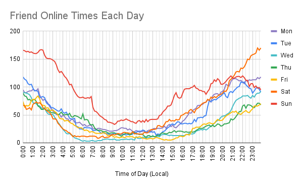

# VRCX Optimal Time

Uses your stored [VRCX](https://github.com/pypy-vrc/VRCX) data to calculate when your friends are online. This data can then be used to chart the optimal times for you to play VRChat if you want to hang out with your friends!

For the best results, you'll need to have used VRCX for a reasonably long time to gather enough data to show trends.

## Installation & Usage

1. Download [vrcx-optimal-time.exe](https://github.com/zkxs/vrcx-optimal-time/releases/latest/download/vrcx-optimal-time-windows-x64.exe), or [your platform's artifact](https://github.com/zkxs/vrcx-optimal-time/releases/latest) for non-Windows OS's.
2. Place the file wherever you want.
3. Create a file name `config.toml` next to the vrcx-optimal-time executable
4. Fill in the config by referencing the provided [example config.toml](doc/config.toml).
5. Run the application to get tab-delimited output in your console.
6. Paste the output into your charting software of choice (for example, Excel or Google Sheets)
7. Create a neat chart!

## Output

Here's an example chart generated from approximately 200 friends worth of data:

## How It Works

1. Create 10 minute "buckets" across a week
   - 7 days/week * 24 hours/day * 60 minutes/hour / (10 minutes/bucket) = 1008 buckets/week
2. Grab all friend online/offline events from `VRCX.sqlite3`
3. Optionally, filter friends to some subset. Perhaps by picking a friend group?
4. Iterate over the events in chronological order
5. For an Online event, add the event time to a UserId -> Time map.
   - If there is already an Online event, simply overwrite it, as we are trying to make time ranges 
6. For an Offline event, pop the preceding Online event from the map
   - If there is no Online event, we can't build a time range, so drop it
   - If the Online->Offline duration is over some threshold, then drop it as being abnormally long and likely erroneous. 
7. For each bucket covered in by the Online->Offline time range, increment the bucket's count by 1.

The buckets now contain the number of friends online during that time. This can be trivially exported to a tab-delimited file and charted as a histogram.
